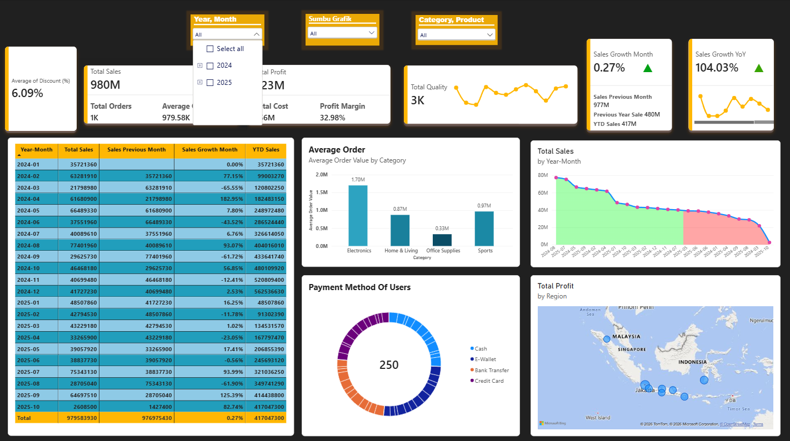
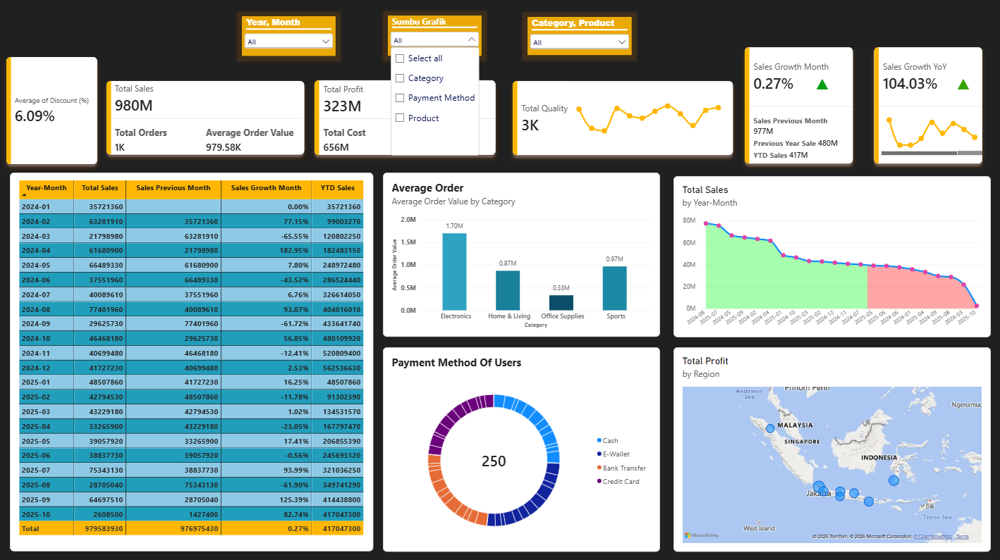
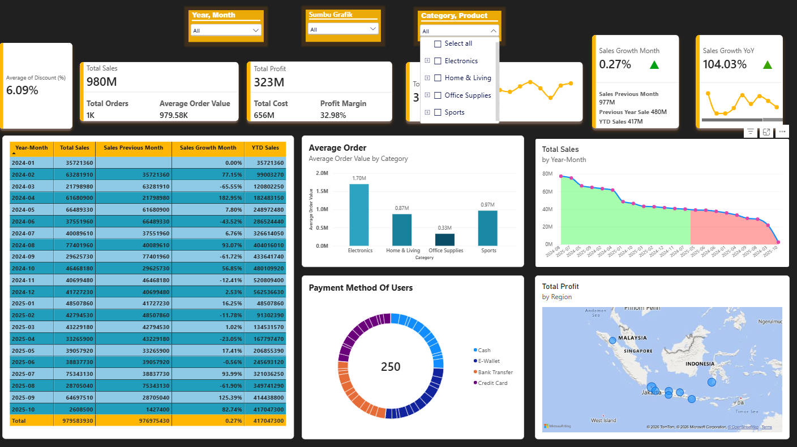
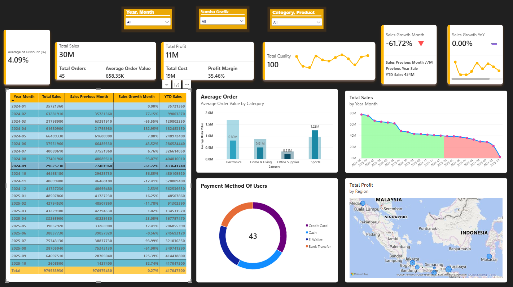
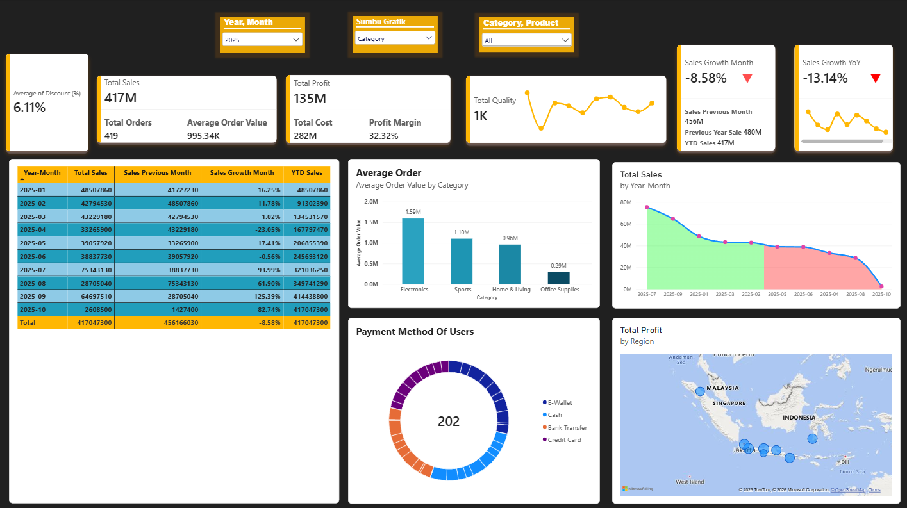

# global_retail_sales_dashboard
An executive level Power BI dashboard analyzing global retail sales trends, financial KPIs, consumer behavior, and regional profitability.

# Interactive Retail Sales & Customer Behavior Analytics

## Project Overview
In the competitive retail sector, static reports are no longer sufficient. Executives require dynamic tools to drill down into operational metrics instantly. The goal of this project was to develop an advanced, interactive Business Intelligence dashboard using **Power BI Desktop**. 

By implementing complex data modeling and cross-filtering mechanisms, this dashboard allows stakeholders to seamlessly navigate through financial KPIs, MoM/YoY growth parameters, customer preferences, and global profit distributions.

---

## Dashboard Dynamic Visualizations & Interactive Slicers
Since this portfolio operates on a public repository, the live interactive cloud feature is simulated below through screenshots showcasing the dashboard's cross-filtering and dynamic capabilities:

### 1. Temporal Analysis (Year & Month Slicer)
Allows users to filter the entire database chronologically, instantly recalculating running Year-To-Date (YTD) sales and monthly growth metrics.

### 2. Parameter Control (Dynamic Axis Slicer)
Demonstrates advanced DAX parameter querying, enabling users to swap chart axes dynamically between categories, products, or payment methods.

### 3. Product Segmentation (Category & Product Slicer)
Enables inventory and supply chain managers to drill down into specific item categories (e.g., Electronics, Sports, Office Supplies) to check localized performance.

### 4. Cross-Filtered Operational Views
Showcasing the dashboard automatically adjusting calculations (e.g., automatically updating Total Orders, Profit Margins, and regional map points) based on selected filters:

---

## Tech Stack & Technical Implementation
- **BI Platform:** Microsoft Power BI Desktop
- **Data Source:** `products-10000(1).csv`
- **Key Features:** Advanced Data Modeling, Time-Intelligence DAX formulas (MoM & YoY Sales Growth), Dynamic Parameter Slicers, and Geographical Map Ingestion.

---

## Key Insights Unlocked
- **Executive Performance:** Monistered a peak baseline of **\$980M in Total Sales** and **\$323M in Total Profit** with a solid **32.98% Profit Margin**.
- **Divergent Growth Indicators:** Tracked a strong **104.03% Sales Growth YoY** alongside shifting MoM growth rates, signaling critical timeline demand shifts.
- **Consumer Behavior Profiling:** Uncovered that **Electronics** command the highest Average Order Value (~\$2.0M), heavily driven by cashless payment methods like **Bank Transfers and Credit Cards**.
- **Supply Chain & Logistics Ingestion:** Mapped major regional profitability heavily concentrated in Southeast Asian logistics hubs, specifically across **Indonesia, Malaysia, and Singapore**.
